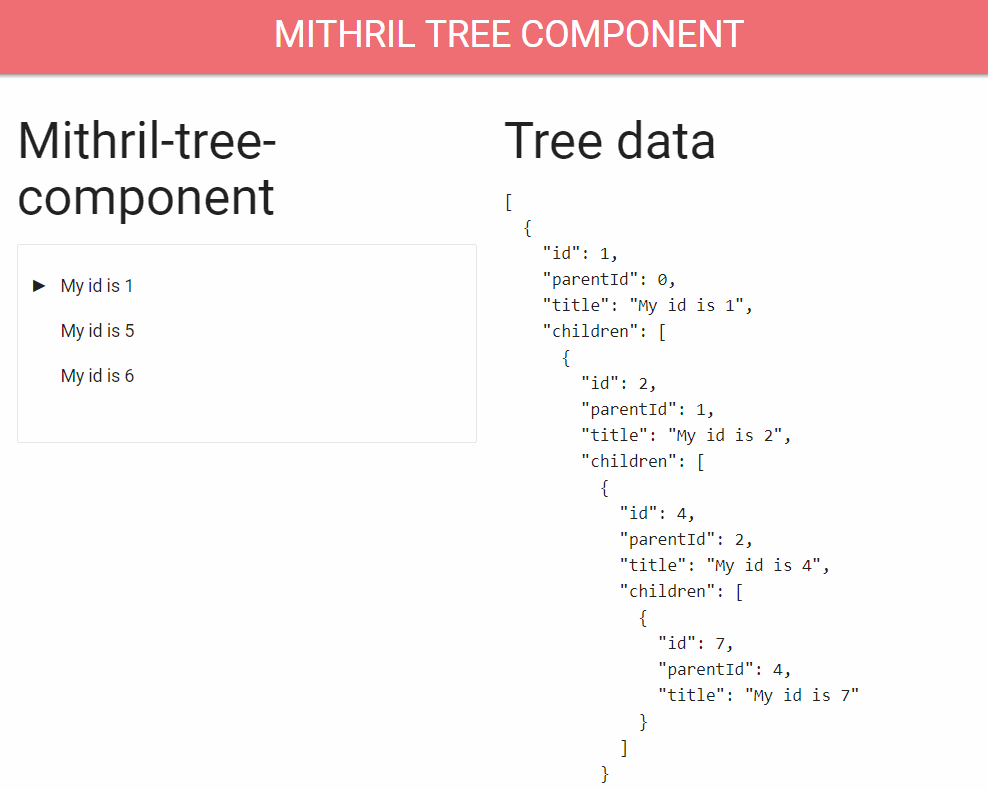

# mithril-tree-component

A tree component for [Mithril](https://mithril.js.org) that supports drag-and-drop, as well as selecting, creating and deleting items. You can play with it [here](https://erikvullings.github.io/mithril-tree-component/#!/).



**Functionality:**
- Drag-and-drop to move items (if editable.canUpdate is true).
- Create and delete tree items (if editable.canDelete and editable.canDeleteParent is true).
- Configurable properties for:
  - id property: unique id of the item.
  - parentId property: id of the parent.
  - name property: display title. Alternatively, provide your own component.
  - children property: id of the property used for child tree nodes.
  - maxDepth: when specified, and editable.canCreate is true, do not add children that would exceed this depth, where depth is 0 for root items, 1 for children, etc.
  - isOpen: to indicate whether the tree should show the children. If not provided, the open/close state is maintained internally. This slightly affects the behaviour of the tree, e.g. after creating items, the parent is not automatically opened.
  - create: can be used to add your own TreeItem creation logic.
- Callback events:
  - onSelect: when a tree item is selected.
  - onBefore[Create | Update | Delete]: can be used to intercept (and block) tree item actions. If the onBeforeX call returns false, the action is stopped.
  - on[Create | Update | Delete]: when the creation is done.
  - When using async functions or promises, please make sure to call m.redraw() when you are done.

This repository contains two projects:
- An example project, showcasing the usage of the component.
- The mithril-tree-component itself.

## Usage

```bash
npm i mithril-tree-component
```

From the [example project](../example). There you can also find some CSS styles.

```ts
import m from 'mithril';
import { unflatten } from '../utils';
import { TreeContainer, ITreeOptions, ITreeItem, uuid4 } from 'mithril-tree-component';

interface IMyTree extends ITreeItem {
  id: number | string;
  parentId: number | string;
  title: string;
}

export const TreeView = () => {
  const data: IMyTree[] = [
    { id: 1, parentId: 0, title: 'My id is 1' },
    { id: 2, parentId: 1, title: 'My id is 2' },
    { id: 3, parentId: 1, title: 'My id is 3' },
    { id: 4, parentId: 2, title: 'My id is 4' },
    { id: 5, parentId: 0, title: 'My id is 5' },
    { id: 6, parentId: 0, title: 'My id is 6' },
    { id: 7, parentId: 4, title: 'My id is 7' },
  ];
  const tree = unflatten(data);
  const options = {
    id: 'id',
    parentId: 'parentId',
    isOpen: 'isOpen',
    name: 'title',
    onSelect: (ti, isSelected) => console.log(`On ${isSelected ? 'select' : 'unselect'}: ${ti.title}`),
    onBeforeCreate: ti => console.log(`On before create ${ti.title}`),
    onCreate: ti => console.log(`On create ${ti.title}`),
    onBeforeDelete: ti => console.log(`On before delete ${ti.title}`),
    onDelete: ti => console.log(`On delete ${ti.title}`),
    onBeforeUpdate: (ti, action, newParent) =>
      console.log(`On before ${action} update ${ti.title} to ${newParent ? newParent.title : ''}.`),
    onUpdate: ti => console.log(`On update ${ti.title}`),
    create: (parent?: IMyTree) => {
      const item = {} as IMyTree;
      item.id = uuid4();
      if (parent) {
        item.parentId = parent.id;
      }
      item.title = `Created at ${new Date().toLocaleTimeString()}`;
      return item as ITreeItem;
    },
    editable: { canCreate: true, canDelete: true, canUpdate: true, canDeleteParent: false },
  } as ITreeOptions;
  return {
    view: () =>
      m('.row', [
        m('.col.s6', [m('h3', 'Mithril-tree-component'), m(TreeContainer, { tree, options })]),
        m('.col.s6', [m('h3', 'Tree data'), m('pre', m('code', JSON.stringify(tree, null, 2)))]),
      ]),
  };
};
```

## Contributing

Pull requests and stars are always welcome.

For bugs and feature requests, please create an issue.

1. Fork it!
2. Create your feature branch: `git checkout -b my-new-feature`
3. Commit your changes: `git commit -am 'Add some feature'`
4. Push to the branch: `git push origin my-new-feature`
5. Submit a pull request :D
